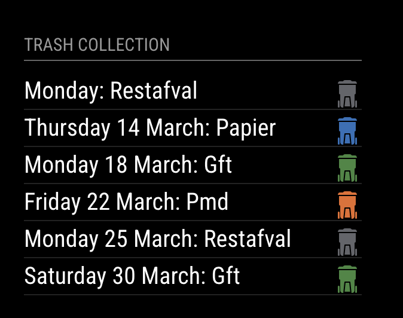

# MMM-Afvalwijzer

Afvalwijzer Trash collection module for [MagicMirror²](https://github.com/MagicMirrorOrg/MagicMirror). Some of the code was re-used from the MMM-ROVA-trashcalendar repository. Not all cities in the Netherland uses the ROVA service, hence the reason why I decided to create this one.

Note: Before installing this module, first visit https://www.mijnafvalwijzer.nl to check if this waste collection schedule is available at your address. If not, you'll need to try another module service in your area. 

Shout-out to Dennis Rosenbaum for adding the Cleanprofs section. With this you can now see when the Cleanprofs company will clean the containers.

## Dependencies

A MagicMirror² installation.

## Installation

In your terminal, go to your MagicMirror's module folder:

```bash
cd ~/MagicMirror/modules
```

Clone this repository and install the dependencies:

```bash
git clone https://github.com/gertperdZA/MMM-Afvalwijzer
```

### Configuration

Add the module to the modules array in the `config/config.js` file and insert your own postal code, housenumber and, if applicable, your house number extention:

```js
    {
      module: 'MMM-Afvalwijzer',
      position: 'top_left',
      config: {
        title: "Trash collection days",
        apiKey: "{ContactMeForTheAPIKey}",
        numberOfweeks: 4,
        houseNumber: "1",
        postalCode: "3607LA",
        streetName: "Valkenkamp",
        extention: "",
        showCleanprofsData: true,
        showColorIcons: true,
        showContainerIcons: true
      }
    },
```

### Configuration options

NOTE: When the module takes a while to load , then it might be that the CleanProfs API is down. Set the 'showCleanprofsData' to false to prevent this issue.

Option|Default|Description
------|------|-----------
`title`|`"Trash Collection"`|Title of this module to show
`apiKey`|{ContactMeForTheAPIKey}|The API key in order to retrieve the data: {ContactMeForTheAPIKey}
`numberOfweeks`|`2`|Indicate the number of weeks you want to see the schedule in advance.
`houseNumber`|`1`|House number of the address
`postalCode`|`"3607NR"`|Postal code of the address
`streetName`|`""`|Street name of the address
`extention`|`""`|House number addition/extention of the address.
`dateFormat`|`"dddd D MMMM"`|Date format
`updateInterval`|`4 * 60 * 60 * 1000`|How often should the data be retrieved
`showCleanprofsData`|`false`|Retrieve the dates that Clean Profs will clean the containers
`showColorIcons`|`true`|Show icons in color when true
`showContainerIcons`|`true`|Show container icons when true

## Sample screenshot




## Special Thanks

Michael Teeuw for creating the awesome MagicMirror² project that made this module possible.

## Support

If you like this module and want to thank me, please buy me a coffee.

<a href="https://www.buymeacoffee.com/gertperdza" target="_blank"></a>

## Developer commands

- `npm install` - Install devDependencies like ESLint.
- `npm run lint` - Run linting and formatter checks.
- `npm run lint:fix` - Fix linting and formatter issues.
